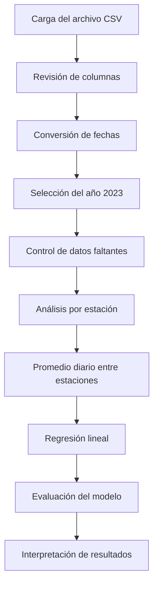

<div align="center">

# Análisis y regresión de las concentraciones diarias de SO₂ durante 2023

### Proyecto de Ingeniería 1

**Bertha Dominik Belevan Amaro**  
**Ingeniería Ambiental — Universidad Peruana Cayetano Heredia**


</div>

---

## Contenido

1. [Introducción](#introducción)
2. [Metodología](#metodología)
3. [Resultados](#resultados)
4. [Discusión](#discusión)
5. [Conclusiones](#conclusiones)
6. [Código utilizado](#código-utilizado)
7. [Referencias](#referencias)

---

# Introducción

El dióxido de azufre (SO₂) es un contaminante atmosférico generado principalmente por la combustión de combustibles que contienen azufre y por determinadas actividades industriales.

Su monitoreo permite evaluar cambios en la calidad del aire, reconocer episodios de concentración elevada e identificar posibles diferencias entre estaciones ubicadas cerca de distintas fuentes de emisión.

En este trabajo se analizaron registros diarios de SO₂ obtenidos mediante la herramienta **Download Daily Data** de la United States Environmental Protection Agency (EPA). El análisis se delimitó al año **2023**, de acuerdo con la indicación de la docente.

Se emplearon técnicas de estadística descriptiva, visualización de datos y regresión lineal para estudiar la variación temporal de la concentración máxima diaria de SO₂.

## Objetivo general

Analizar la variación temporal de la concentración máxima diaria de SO₂ durante 2023 mediante estadística descriptiva, visualizaciones y un modelo de regresión lineal.

## Objetivos específicos

- Verificar la estructura y calidad del dataset descargado de la EPA.
- Comparar las concentraciones registradas en las cinco estaciones.
- Describir el comportamiento diario y mensual del SO₂ durante 2023.
- Ajustar una regresión lineal entre el tiempo transcurrido y la concentración diaria promedio.
- Evaluar el modelo mediante MAE, RMSE y el coeficiente de determinación.
- Interpretar las limitaciones del modelo y los factores que podrían explicar la variación observada.

---

# Metodología

## Descripción del dataset

La información procede del **Air Quality System (AQS)** de la EPA, un sistema que almacena datos de contaminación atmosférica obtenidos mediante estaciones de monitoreo.

| Característica | Descripción |
|---|---|
| Contaminante | Dióxido de azufre (SO₂) |
| Año analizado | 2023 |
| Periodo | 1 de enero al 31 de diciembre |
| Número de registros | 1,774 |
| Número de columnas | 28 |
| Número de estaciones | 5 |
| Unidad | Partes por mil millones (ppb) |
| Variable analizada | `Daily Max SO2 Concentration` |
| Fuente | EPA Air Quality System |

## Variables principales

| Variable | Descripción |
|---|---|
| `Date` | Fecha de la medición |
| `Site ID` | Identificador de la estación |
| `Local Site Name` | Nombre de la estación |
| `Daily Max SO2 Concentration` | Concentración máxima diaria de SO₂ |
| `Daily AQI Value` | Índice diario de calidad del aire |
| `Daily Obs Count` | Número de observaciones diarias |
| `Percent Complete` | Porcentaje de datos disponibles |
| `Site Latitude` | Latitud de la estación |
| `Site Longitude` | Longitud de la estación |
| `Units` | Unidad de medición |

## Procedimiento

El análisis se desarrolló en Python mediante Google Colab y comprendió las siguientes etapas:



## Preparación de los datos

La columna `Date` se convirtió al formato de fecha y la variable `Daily Max SO2 Concentration` se transformó a tipo numérico.

Posteriormente, se seleccionaron exclusivamente los registros correspondientes a 2023. También se revisaron los valores ausentes y los registros duplicados.

## Agregación diaria

Para cada fecha se calculó el promedio de las concentraciones máximas reportadas por las estaciones disponibles:

$$
\overline{SO_{2,t}}
=
\frac{1}{n_t}
\sum_{i=1}^{n_t} SO_{2,i,t}
$$

donde:

- $SO_{2,i,t}$ es la concentración máxima diaria registrada en la estación $i$ durante el día $t$.
- $n_t$ es el número de estaciones disponibles durante el día $t$.
- $\overline{SO_{2,t}}$ es la concentración máxima diaria promedio entre estaciones.

Este promedio facilita el análisis general, pero **no constituye por sí solo una métrica regulatoria de cumplimiento**.

## Regresión lineal

El modelo empleado fue:

$$
\widehat{SO_2}
=
\beta_0+\beta_1t
$$

donde:

- $\widehat{SO_2}$ es la concentración estimada de dióxido de azufre.
- $\beta_0$ es el intercepto del modelo.
- $\beta_1$ representa el cambio promedio estimado por día.
- $t$ es el número de días transcurridos desde el 1 de enero de 2023.

Los datos se dividieron en:

- **80 % para entrenamiento.**
- **20 % para prueba.**

Se utilizó `random_state=42` para obtener resultados reproducibles.

## Métricas de evaluación

### Error absoluto medio

El MAE representa el error promedio entre los valores observados y estimados:

$$
MAE
=
\frac{1}{n}
\sum_{i=1}^{n}
\left|
y_i-\widehat{y_i}
\right|
$$

### Raíz del error cuadrático medio

El RMSE penaliza con mayor intensidad los errores grandes:

$$
RMSE
=
\sqrt{
\frac{1}{n}
\sum_{i=1}^{n}
\left(
y_i-\widehat{y_i}
\right)^2
}
$$

### Coeficiente de determinación

El coeficiente de determinación indica qué proporción de la variabilidad es explicada por el modelo:

$$
R^2
=
1-
\frac{
\sum_{i=1}^{n}
\left(
y_i-\widehat{y_i}
\right)^2
}{
\sum_{i=1}^{n}
\left(
y_i-\overline{y}
\right)^2
}
$$

---

# Resultados

## Control de calidad de los datos

| Indicador | Resultado |
|---|---:|
| Registros de 2023 | 1,774 |
| Fecha inicial | 2023-01-01 |
| Fecha final | 2023-12-31 |
| Estaciones diferentes | 5 |
| Valores ausentes en fecha | 0 |
| Valores ausentes en concentración | 0 |
| Duplicados por fecha y estación | 0 |
| Días representados | 365 |

La base presenta registros correspondientes a todos los días de 2023.

Se identificaron algunos valores negativos cercanos a cero. Estos valores se conservaron tal como aparecen en el archivo oficial, ya que su modificación requeriría una regla de validación proporcionada por la fuente.

En mediciones ambientales, valores pequeños negativos pueden aparecer debido a la incertidumbre instrumental alrededor del límite de detección.

## Comparación entre estaciones

| Estación | Registros | Media (ppb) | Mediana (ppb) | Máximo (ppb) |
|---|---:|---:|---:|---:|
| Lhoist, Montevallo Plant | 363 | 7.413 | 1.800 | 72.700 |
| North Birmingham | 362 | 2.392 | 1.700 | 17.500 |
| CHICKASAW | 330 | 1.939 | 1.200 | 25.100 |
| Ward, Sumter Co. | 356 | 1.630 | 1.600 | 6.400 |
| Fairfield | 363 | 0.984 | 0.700 | 12.600 |

<div align="center">


**Figura 1. Concentración máxima diaria media de SO₂ por estación durante 2023.**

</div>

La estación **Lhoist, Montevallo Plant** presentó una media considerablemente mayor que las demás estaciones.

También registró el mayor valor máximo del dataset, con **72.7 ppb**. La diferencia entre su media y mediana indica una distribución asimétrica influenciada por algunos episodios elevados.

Estos resultados demuestran que la ubicación del monitor debe considerarse al interpretar el promedio general.

## Evolución diaria

Se obtuvieron 365 promedios diarios utilizando las estaciones disponibles en cada fecha.

<div align="center">


**Figura 2. Evolución de la concentración máxima diaria promedio de SO₂ durante 2023.**

</div>

La serie presenta numerosos valores bajos y algunos incrementos puntuales. Los episodios más notorios se observaron principalmente durante marzo, septiembre y noviembre.

La concentración máxima diaria promedio entre estaciones fue de **2.863 ppb**, mientras que el mayor promedio diario alcanzó **17.160 ppb**.

## Comportamiento mensual

| Mes | Media (ppb) | Mediana (ppb) | Máximo (ppb) |
|---|---:|---:|---:|
| Enero | 1.662 | 1.180 | 9.140 |
| Febrero | 1.599 | 0.840 | 7.275 |
| Marzo | 2.772 | 1.660 | 14.260 |
| Abril | 2.754 | 1.550 | 9.780 |
| Mayo | 2.994 | 1.880 | 10.120 |
| Junio | 2.666 | 1.490 | 10.820 |
| Julio | 1.970 | 1.260 | 8.320 |
| Agosto | 2.998 | 2.050 | 10.780 |
| Septiembre | 4.873 | 4.060 | 15.020 |
| Octubre | 3.551 | 2.020 | 9.440 |
| Noviembre | 4.071 | 2.610 | 17.160 |
| Diciembre | 2.438 | 1.600 | 11.400 |

<div align="center">


**Figura 3. Concentración máxima diaria promedio de SO₂ por mes durante 2023.**

</div>

**Septiembre** presentó la mayor media mensual, con aproximadamente **4.873 ppb**, seguido de noviembre, con **4.071 ppb**.

La comparación mensual permite identificar diferencias temporales, pero no demuestra por sí sola que el mes o la estación del año sean las causas de los incrementos.

## Resultados de la regresión lineal

Al ajustar la recta con los 365 promedios diarios se obtuvo:

$$
\widehat{SO_2}
=
1.9161+0.005204t
$$

La pendiente positiva indica un incremento estimado de:

$$
0.005204\ \text{ppb por día}
$$

Esto equivale aproximadamente a:

$$
0.520\ \text{ppb por cada 100 días}
$$

<div align="center">


**Figura 4. Regresión lineal de la concentración diaria promedio de SO₂ durante 2023.**

</div>

La recta muestra una tendencia ligeramente creciente. Sin embargo, los datos presentan una alta dispersión y varios picos alejados de la línea de regresión.

## Evaluación del modelo

| Métrica | Resultado |
|---|---:|
| MAE | 1.8704 ppb |
| RMSE | 2.5619 ppb |
| $R^2$ del conjunto de prueba | 0.0784 |
| $R^2$ descriptivo anual | 0.0389 |

El MAE indica que las estimaciones se alejaron, en promedio, aproximadamente **1.87 ppb** de los valores observados.

El RMSE fue mayor que el MAE porque penaliza con más intensidad los errores grandes generados por los episodios elevados.

El valor descriptivo:

$$
R^2=0.0389
$$

indica que el paso del tiempo explicó aproximadamente:

$$
3.9\%
$$

de la variación diaria registrada durante 2023.

<div align="center">


**Figura 5. Comparación entre valores observados y estimados en el conjunto de prueba.**

</div>

La línea diagonal representa una predicción perfecta.

La concentración de los puntos alrededor de valores estimados bajos muestra que la regresión tiene dificultades para reproducir los episodios elevados de SO₂.

## Resumen de resultados

| Hallazgo | Resultado |
|---|---:|
| Registros analizados | 1,774 |
| Estaciones | 5 |
| Días analizados | 365 |
| Promedio diario general | 2.863 ppb |
| Mayor promedio diario | 17.160 ppb |
| Estación con mayor media | Lhoist, Montevallo Plant |
| Media de la estación más elevada | 7.413 ppb |
| Mes con mayor promedio | Septiembre |
| Pendiente temporal | 0.005204 ppb/día |
| $R^2$ descriptivo | 0.0389 |
| Variación explicada por el tiempo | 3.9 % |

> **Resultado principal:** la regresión identifica una tendencia ligeramente creciente, pero el paso del tiempo por sí solo no explica adecuadamente las variaciones ni los episodios elevados de SO₂.

---

# Discusión

Los resultados muestran diferencias importantes entre las cinco estaciones analizadas.

Lhoist, Montevallo Plant presentó una concentración media superior a la registrada en las demás estaciones. Esta diferencia podría estar relacionada con la proximidad a fuentes industriales. Sin embargo, el dataset analizado no permite demostrar una relación causal.

La pendiente positiva representa una tendencia general ligeramente creciente durante 2023. No obstante, el bajo coeficiente de determinación demuestra que la relación entre el tiempo y la concentración diaria es débil.

Las variaciones observadas podrían estar relacionadas con factores que no fueron incorporados al modelo, como:

- Intensidad y horario de las emisiones.
- Velocidad y dirección del viento.
- Temperatura atmosférica.
- Precipitación.
- Altura de la capa de mezcla.
- Distancia entre los monitores y las fuentes emisoras.
- Diferencias en el entorno de cada estación.

El gráfico de valores observados y estimados muestra que el modelo tiende a subestimar los días con concentraciones elevadas.

Esto ocurre porque una regresión lineal simple representa una tendencia promedio y no está diseñada para reproducir incrementos repentinos.

Por tanto, el modelo resulta útil para describir la dirección general de la serie, pero presenta una capacidad predictiva limitada.

## Limitaciones

1. El estudio analiza únicamente el año 2023.
2. La regresión utiliza el tiempo como única variable explicativa.
3. No se incluyeron datos meteorológicos.
4. El promedio diario combina estaciones con ubicaciones y características diferentes.
5. Los eventos extremos influyen en la media y en las métricas de error.
6. La división aleatoria no sustituye una validación temporal orientada al pronóstico.
7. La regresión identifica una asociación y no demuestra causalidad.

En un estudio posterior sería recomendable analizar cada estación por separado e incorporar variables meteorológicas y características de las fuentes emisoras.

---

# Conclusiones

1. El dataset permitió analizar **1,774 registros de SO₂**, correspondientes a cinco estaciones y los 365 días de 2023.

2. Las concentraciones presentaron diferencias considerables entre estaciones. Lhoist, Montevallo Plant registró la mayor media y el mayor valor máximo.

3. Septiembre y noviembre presentaron los promedios mensuales más elevados.

4. La regresión lineal identificó una tendencia ligeramente creciente de aproximadamente **0.005204 ppb por día**.

5. El $R^2$ descriptivo fue **0.0389**, por lo que el tiempo explicó aproximadamente el **3.9 % de la variación diaria**.

6. La fecha no resulta suficiente para predecir los episodios elevados. Se necesitan variables meteorológicas, información sobre las fuentes de emisión y modelos con mayor capacidad para representar relaciones no lineales.

---

# Código utilizado

<details>
<summary><strong>Mostrar el código completo desarrollado en Google Colab</strong></summary>

<br>

```python
# ============================================================
# 1. IMPORTACIÓN DE LIBRERÍAS
# ============================================================

import warnings
warnings.filterwarnings("ignore")

import numpy as np
import pandas as pd
import matplotlib.pyplot as plt
import seaborn as sns

from google.colab import files
from sklearn.linear_model import LinearRegression
from sklearn.model_selection import train_test_split
from sklearn.metrics import (
    mean_absolute_error,
    mean_squared_error,
    r2_score
)

sns.set_theme(style="whitegrid", palette="deep")

plt.rcParams["figure.figsize"] = (11, 5)
plt.rcParams["axes.titlesize"] = 14
plt.rcParams["axes.labelsize"] = 11


# ============================================================
# 2. CARGA DEL DATASET
# ============================================================

uploaded = files.upload()

nombre_archivo = next(iter(uploaded))

df = pd.read_csv(nombre_archivo)

print(f"Archivo cargado: {nombre_archivo}")

print(
    f"Dimensiones: "
    f"{df.shape[0]:,} filas y "
    f"{df.shape[1]} columnas"
)

display(df.head())


# ============================================================
# 3. REVISIÓN DE COLUMNAS
# ============================================================

columnas_necesarias = {
    "Date",
    "Site ID",
    "Local Site Name",
    "Daily Max SO2 Concentration",
    "Units"
}

columnas_faltantes = (
    columnas_necesarias
    .difference(df.columns)
)

if columnas_faltantes:
    raise ValueError(
        "Faltan columnas necesarias: "
        f"{sorted(columnas_faltantes)}"
    )


# ============================================================
# 4. PREPARACIÓN DE LOS DATOS
# ============================================================

datos = df.copy()

datos["Date"] = pd.to_datetime(
    datos["Date"],
    errors="coerce"
)

datos["Daily Max SO2 Concentration"] = pd.to_numeric(
    datos["Daily Max SO2 Concentration"],
    errors="coerce"
)

# Selección del año indicado por la docente
datos = datos.loc[
    datos["Date"].dt.year.eq(2023)
].copy()


# ============================================================
# 5. CONTROL DE CALIDAD
# ============================================================

resumen_calidad = pd.DataFrame({
    "Indicador": [
        "Registros de 2023",
        "Fecha inicial",
        "Fecha final",
        "Estaciones",
        "Valores ausentes en fecha",
        "Valores ausentes en concentración",
        "Duplicados por fecha y estación"
    ],
    "Resultado": [
        len(datos),
        datos["Date"].min().date(),
        datos["Date"].max().date(),
        datos["Site ID"].nunique(),
        datos["Date"].isna().sum(),
        datos[
            "Daily Max SO2 Concentration"
        ].isna().sum(),
        datos.duplicated(
            ["Date", "Site ID"]
        ).sum()
    ]
})

display(resumen_calidad)

print("Unidades registradas:")

display(
    datos["Units"]
    .value_counts()
    .rename_axis("Unidad")
    .to_frame("Registros")
)

print("Estaciones incluidas:")

display(
    datos[
        [
            "Site ID",
            "Local Site Name",
            "Site Latitude",
            "Site Longitude"
        ]
    ]
    .drop_duplicates()
    .sort_values("Local Site Name")
    .reset_index(drop=True)
)


# ============================================================
# 6. ESTADÍSTICA DESCRIPTIVA
# ============================================================

estadisticas = (
    datos[
        "Daily Max SO2 Concentration"
    ]
    .describe()
    .rename({
        "count": "Número de registros",
        "mean": "Media",
        "std": "Desviación estándar",
        "min": "Mínimo",
        "25%": "Percentil 25",
        "50%": "Mediana",
        "75%": "Percentil 75",
        "max": "Máximo"
    })
    .to_frame("SO₂ (ppb)")
)

display(
    estadisticas.round(3)
)


# ============================================================
# 7. ANÁLISIS POR ESTACIÓN
# ============================================================

resumen_estacion = (
    datos
    .groupby(
        "Local Site Name"
    )[
        "Daily Max SO2 Concentration"
    ]
    .agg(
        Registros="count",
        Media="mean",
        Mediana="median",
        Máximo="max"
    )
    .sort_values(
        "Media",
        ascending=False
    )
)

display(
    resumen_estacion.round(3)
)


# ============================================================
# 8. GRÁFICA POR ESTACIÓN
# ============================================================

ax = (
    resumen_estacion["Media"]
    .sort_values()
    .plot(
        kind="barh",
        color="#4C78A8",
        edgecolor="white"
    )
)

ax.set_title(
    "Concentración máxima diaria media "
    "de SO₂ por estación, 2023"
)

ax.set_xlabel(
    "SO₂ (ppb)"
)

ax.set_ylabel(
    "Estación"
)

plt.tight_layout()
plt.show()


# ============================================================
# 9. SERIE DIARIA AGREGADA
# ============================================================

diario = (
    datos
    .groupby(
        "Date",
        as_index=False
    )
    .agg(
        SO2_promedio=(
            "Daily Max SO2 Concentration",
            "mean"
        ),
        SO2_mediana=(
            "Daily Max SO2 Concentration",
            "median"
        ),
        estaciones=(
            "Site ID",
            "nunique"
        )
    )
    .sort_values("Date")
)

diario["dia_desde_inicio"] = (
    diario["Date"]
    -
    diario["Date"].min()
).dt.days

diario["mes"] = (
    diario["Date"].dt.month
)

print(
    f"Días analizados: {len(diario)}"
)

display(
    diario.head()
)


# ============================================================
# 10. EVOLUCIÓN DIARIA
# ============================================================

fig, ax = plt.subplots(
    figsize=(12, 5)
)

ax.plot(
(
    diario["Date"],
    diario["SO2_promedio"],
    color="#4C78A8",
    linewidth=1.2
)

ax.set_title(
    "Evolución de la concentración máxima "
    "diaria promedio de SO₂, 2023"
)

ax.set_xlabel(
    "Fecha"
)

ax.set_ylabel(
    "SO₂ promedio entre estaciones (ppb)"
)

plt.tight_layout()
plt.show()


# ============================================================
# 11. RESUMEN MENSUAL
# ============================================================

resumen_mensual = (
    diario
    .assign(
        Mes=diario[
            "Date"
        ].dt.strftime("%m")
    )
    .groupby(
        "Mes"
    )[
        "SO2_promedio"
    ]
    .agg(
        Media="mean",
        Mediana="median",
        Máximo="max"
    )
)

display(
    resumen_mensual.round(3)
)


# ============================================================
# 12. GRÁFICA MENSUAL
# ============================================================

ax = resumen_mensual[
    "Media"
].plot(
    kind="bar",
    color="#72B7B2",
    edgecolor="white"
)

ax.set_title(
    "Concentración máxima diaria promedio "
    "de SO₂ por mes, 2023"
)

ax.set_xlabel(
    "Mes"
)

ax.set_ylabel(
    "SO₂ (ppb)"
)

ax.tick_params(
    axis="x",
    rotation=0
)

plt.tight_layout()
plt.show()


# ============================================================
# 13. REGRESIÓN LINEAL
# ============================================================

X = diario[
    ["dia_desde_inicio"]
]

y = diario[
    "SO2_promedio"
]

X_train, X_test, y_train, y_test = train_test_split(
    X,
    y,
    test_size=0.20,
    random_state=42
)

modelo = LinearRegression()

modelo.fit(
    X_train,
    y_train
)

y_pred = modelo.predict(
    X_test
)


# ============================================================
# 14. EVALUACIÓN DEL MODELO
# ============================================================

mae = mean_absolute_error(
    y_test,
    y_pred
)

rmse = np.sqrt(
    mean_squared_error(
        y_test,
        y_pred
    )
)

r2 = r2_score(
    y_test,
    y_pred
)

metricas = pd.DataFrame({
    "Métrica": [
        "MAE",
        "RMSE",
        "R²"
    ],
    "Valor": [
        mae,
        rmse,
        r2
    ]
})

print(
    "Ecuación del modelo de entrenamiento: "
    f"SO₂ = {modelo.intercept_:.4f} "
    f"+ ({modelo.coef_[0]:.6f} × día)"
)

display(
    metricas.round(4)
)


# ============================================================
# 15. TENDENCIA DESCRIPTIVA ANUAL
# ============================================================

modelo_total = LinearRegression()

modelo_total.fit(
    X,
    y
)

diario["tendencia_lineal"] = (
    modelo_total.predict(X)
)

fig, ax = plt.subplots(
    figsize=(12, 5)
)

ax.scatter(
    diario["Date"],
    diario["SO2_promedio"],
    s=18,
    alpha=0.55,
    color="#4C78A8",
    label="Promedio diario observado"
)

ax.plot(
    diario["Date"],
    diario["tendencia_lineal"],
    color="#E45756",
",
    linewidth=2.5,
    label="Regresión lineal"
)

ax.set_title(
    "Regresión lineal de la concentración "
    "diaria promedio de SO₂, 2023"
)

ax.set_xlabel(
    "Fecha"
)

ax.set_ylabel(
    "SO₂ promedio entre estaciones (ppb)"
)

ax.legend()

plt.tight_layout()
plt.show()

print(
    "Ecuación descriptiva anual: "
    f"SO₂ = {modelo_total.intercept_:.4f} "
    f"+ ({modelo_total.coef_[0]:.6f} × día)"
)

print(
    "R² descriptivo con todos los datos: "
    f"{modelo_total.score(X, y):.4f}"
)


# ============================================================
# 16. VALORES OBSERVADOS Y ESTIMADOS
# ============================================================

fig, ax = plt.subplots(
    figsize=(6.5, 6)
)

ax.scatter(
    y_test,
    y_pred,
    alpha=0.70,
    color="#59A14F"
)

limite_min = min(
    y_test.min(),
    y_pred.min()
)

limite_max = max(
    y_test.max(),
    y_pred.max()
)

ax.plot(
    [limite_min, limite_max],
    [limite_min, limite_max],
    "--",
    color="#E45756"
)

ax.set_title(
    "Valores observados y estimados "
    "en el conjunto de prueba"
)

ax.set_xlabel(
    "SO₂ observado (ppb)"
)

ax.set_ylabel(
    "SO₂ estimado (ppb)"
)

plt.tight_layout()
plt.show()


# ============================================================
# 17. INTERPRETACIÓN AUTOMÁTICA
# ============================================================

direccion = (
    "aumentó"
    if modelo_total.coef_[0] > 0
    else "disminuyó"
)

porcentaje_explicado = max(
    modelo_total.score(X, y),
    0
) * 100

print(
    f"""
La base analizada contiene
{len(datos):,} registros de 2023,
procedentes de
{datos["Site ID"].nunique()} estaciones.

La concentración máxima diaria promedio
entre estaciones fue de
{diario["SO2_promedio"].mean():.3f} ppb.

El mayor promedio diario fue de
{diario["SO2_promedio"].max():.3f} ppb.

La pendiente anual fue de
{modelo_total.coef_[0]:.6f} ppb por día.

La tendencia lineal
{direccion} ligeramente durante 2023.

El R² descriptivo fue
{modelo_total.score(X, y):.4f}.

La fecha explicó aproximadamente
{porcentaje_explicado:.1f} %
de la variación observada.

El MAE de prueba fue
{mae:.3f} ppb.

El RMSE de prueba fue
{rmse:.3f} ppb.
"""
)
```

</details>

---

# Referencias

[1] U.S. Environmental Protection Agency, “Air Quality System (AQS),” *EPA*. [En línea]. Disponible en: https://www.epa.gov/aqs. [Accedido: 18-sep-2026].

[2] U.S. Environmental Protection Agency, “Download Daily Data,” *Outdoor Air Quality Data*. [En línea]. Disponible en: https://www.epa.gov/outdoor-air-quality-data/download-daily-data. [Accedido: 18-sep-2026].

[3] Scikit-learn developers, “LinearRegression,” *Scikit-learn documentation*. [En línea]. Disponible en: https://scikit-learn.org/stable/modules/generated/sklearn.linear_model.LinearRegression.html. [Accedido: 18-sep-2026].

[4] Scikit-learn developers, “Metrics and scoring: quantifying the quality of predictions,” *Scikit-learn documentation*. [En línea]. Disponible en: https://scikit-learn.org/stable/modules/model_evaluation.html. [Accedido: 18-sep-2026].

---

<div align="center">

**Análisis elaborado con datos oficiales de la EPA y herramientas reproducibles de de Python.**

</div>
