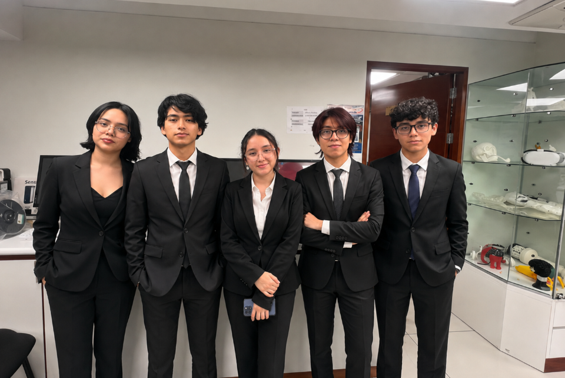

<table>
  <tr>
    <td></td>
    <td style="vertical-align: middle; padding-left: 15px;">
      <h1>UNIVERSIDAD PERUANA CAYETANO HEREDIA</h1>
    </td>
  </tr>
</table>

<h3 align="center">PROYECTOS PARA INGENIERIA – GRUPO 6</h3>

## 🏠 CrackScan
Dispositivo portátil para detección y registro de grietas en estructuras de concreto en zonas de alto riesgo
---

## ⚠️ Problemática

Las grietas pueden indicar procesos de deterioro en las estructuras de concreto, por lo que su evaluación requiere registrar características como su ubicación y dimensiones (1). Sin embargo, la inspección visual convencional suele depender de la experiencia del inspector, demanda tiempo y puede producir resultados subjetivos o poco uniformes, dificultando el registro sistemático de la información (2).

Ante esta problemática, **CrackScan** propone facilitar la inspección preliminar mediante un dispositivo portátil capaz de capturar imágenes estables y registrar información sobre la ubicación y las características de las grietas. La herramienta busca apoyar la recopilación de datos en campo, sin reemplazar la evaluación realizada por un especialista.

## 🌍 Descripción del Equipo

Somos el **Equipo 06** del curso **Proyecto Integrador 2026-2**, conformado por estudiantes de **Ingeniería Ambiental e Ingeniería Informática**.

**CrackScan** es un **dispositivo portátil e inteligente** capaz de detectar y **registrar grietas en estructuras de concreto** mediante el análisis automatizado de imágenes, identificando su ubicación, orientación, longitud y ancho aproximado para facilitar la priorización de inspecciones técnicas.

El sistema está orientado principalmente a **zonas de alto riesgo**, permitiendo realizar inspecciones preliminares de manera autónoma y sin depender de conexión a Internet, con el objetivo de facilitar la identificación y registro de estructuras que requieran una evaluación técnica más detallada.

---

### 🎯 Objetivos de Desarrollo Sostenible (ODS)

| ODS | Meta | Impacto esperado |
|---|---|---|
| 🏗️ **ODS 9: Industria, innovación e infraestructura** | **Meta 9.1:** Desarrollar infraestructuras fiables, sostenibles, resilientes y de calidad. | 🔎 **Contribuir al monitoreo preventivo de infraestructuras de concreto**, facilitando la detección y registro de grietas mediante una herramienta portátil. |
| 🏘️ **ODS 11: Ciudades y comunidades sostenibles** | **Meta 11.5:** Reducir las pérdidas y afectaciones ocasionadas por desastres. | 🛡️ **Apoyar la identificación temprana de estructuras que requieran inspección especializada**. |

---

## 📸 Fotografía del Equipo  

  <em>Figura 1. Fotografía del equipo 06</em>

---

## 🎯 Misión

Desarrollar una **herramienta portátil, accesible e inteligente** que facilite la detección y registro de grietas en estructuras de concreto mediante **visión computacional y Machine Learning**, contribuyendo a realizar inspecciones preliminares en zonas de alto riesgo con acceso limitado a tecnología especializada.

---

## 👁️ Visión

Convertir **CrackScan** en una herramienta tecnológica **confiable, accesible y escalable** que contribuya al monitoreo preventivo de estructuras de concreto y facilite la identificación temprana de posibles daños.

---
## 👥 Integrantes del Equipo  

| Foto | Nombre | Carrera | Rol | Intereses |
|------|--------|---------|-----|-----------|
|  | **Belevan Amaro, Bertha Dominik** | Ingeniería Ambiental | Líder del equipo | Innovación social, sostenibilidad |
|  | **Huaman Bernal, Mónica Cristina** | Ingeniería Ambiental | Responsable de investigación | Gestión ambiental, desarrollo comunitario |
|  | **Romero Meza, Piero Cemei** | Ingeniería Informática | Diseñador | Diseño de prototipos, creatividad aplicada |
|  | **Sayago Morán, Josue Enmanuel** | Ingeniería Ambiental | Encargado de documentación | Comunicación científica, redacción técnica |
|  | **Murga Saavedra, Diego Alessandre** | Ingeniería Informática | Programador y modelador | Programación, análisis de datos, simulación |

---
## Antecedentes
La revisión de patentes internacionales se realizó como parte de la estrategia de vigilancia tecnológica para identificar antecedentes de diseño, métodos de inspección y soluciones de hardware ya patentadas en el control de seguridad estructural.

En la evaluación de seguridad estructural, los métodos tradicionales presentan limitaciones para medir simultáneamente el ancho y largo de las fisuras, generando bases de datos insuficientes. Para solucionar esto, existen antecedentes de sistemas de inspección que utilizan cámaras fotográficas alineadas frente a las fallas con marcadores de escala, logrando capturar ambas dimensiones en una sola imagen. La integración de una cámara en el sistema se justifica porque permite automatizar las mediciones periódicas, simplifica la recolección in situ y garantiza la obtención de registros geométricos más completos, lo cual es indispensable para un análisis de deformación preciso (3).

---
## 📌 Resumen Final

Este README presenta quiénes somos como **Equipo 06**, la problemática que buscamos abordar y la propuesta que desarrollaremos durante el curso **Proyecto Integrador 2026-2**.
 
Nuestro proyecto propone **CrackScan**, un **dispositivo portátil e inteligente para la detección y registro de grietas en estructuras de concreto**, integrando tecnologías como **visión computacional, Machine Learning y georreferenciación**.

El sistema está orientado principalmente a **zonas de alto riesgo**, donde el acceso a herramientas tecnológicas especializadas y la conectividad pueden ser limitados. Por ello, CrackScan estará diseñado para realizar **inspecciones preliminares de manera autónoma y sin depender de conexión a Internet**.

El sistema permitirá obtener y almacenar información relevante como:

- 🔎 **Detección de grietas:** identificación automática mediante visión computacional.
- 🖼️ **Localización de grietas:** reconocimiento de la zona afectada dentro de la imagen.
- 📐 **Orientación de la grieta:** vertical, horizontal o diagonal.
- 📍 **Georreferenciación:** registro de la ubicación de cada inspección mediante GPS.
- 💾 **Registro offline:** almacenamiento local de imágenes y resultados sin necesidad de Internet.
- 📋 **Historial de inspecciones:** organización de los registros para facilitar su posterior revisión.

De esta manera, buscamos transformar imágenes y datos recopilados en **información útil para apoyar inspecciones preliminares**, facilitando la identificación y registro de estructuras de concreto que requieran una evaluación técnica más detallada.

> 🏗️ **Nuestro propósito:** Acercar herramientas inteligentes de inspección mediante una solución portátil, accesible y autónoma.

## 🌍 ODS relacionados

  🏗️ <b>ODS 9: Industria, innovación e infraestructura</b>
  &nbsp; • &nbsp;
  🏘️ <b>ODS 11: Ciudades y comunidades sostenibles</b>

---

  💡 <b>Tecnología + Prevención + Infraestructura Resiliente</b> 🏗️

  <i>Equipo 06 | Proyecto Integrador 2026-2</i>

---
---

## 📚 Referencias

> Fuentes técnicas y académicas utilizadas para la formulación y desarrollo de **CrackScan**.

| N.° | Referencia en formato IEEE |
|:---:|---|
| **[1]** | Federal Highway Administration, “Distresses for continuously reinforced concrete pavements,” in *Distress Identification Manual for the Long-Term Pavement Performance Program*, 5th ed., Washington, DC, USA, May 2014, Rep. FHWA-HRT-13-092. [🔗 Consultar fuente](https://www.concrete.org/publications/internationalconcreteabstractsportal.aspx?id=18555&m=details) |
| **[2]** | L. Ali, F. Alnajjar, H. Al Jassmi, M. Gocho, W. Khan and M. A. Serhani, “Performance evaluation of deep CNN-based crack detection and localization techniques for concrete structures,” *Sensors*, vol. 21, no. 5, Art. no. 1688, Mar. 2021, doi: 10.3390/s21051688. [🔗 Consultar artículo](https://doi.org/10.3390/s21051688) |
| **[3]** | L. Lu, J. Wu, G. Qiao, Z. Qiu, L. Qiu and J. Sun, “Automatic crack detector with camera,” China Patent CN 111536881A, Aug. 14, 2020. [🔗 Consultar patente](https://patents.google.com/patent/CN111536881A/en) |

---

  <i>Referencias empleadas para sustentar la detección, evaluación y registro de grietas en estructuras de concreto.</i>

