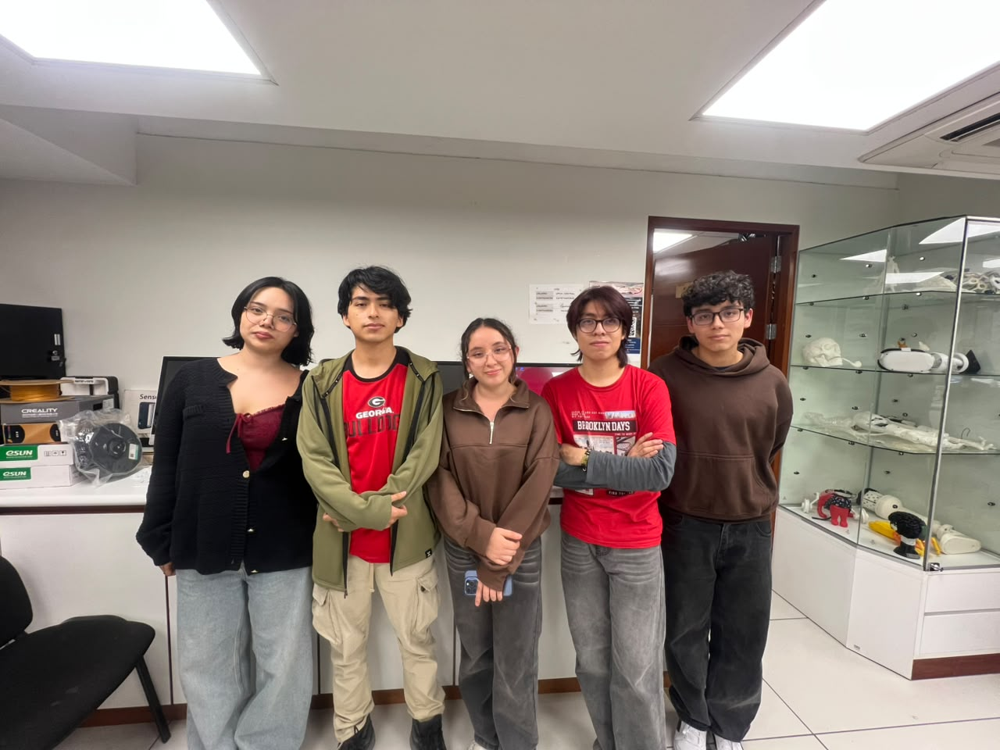

# Equipo 06 - Proyecto Integrador
### Carrera de Ingeniería Ambiental / Informática
**Universidad Peruana Cayetano Heredia**

---

## 🌍 Descripción del Equipo 
Somos el **Equipo 06** del curso **Proyecto Integrador 2026-2**, conformado por estudiantes de la carrera de Ingeniería Ambiental / Informática / Industrial.  
Nuestro objetivo es aplicar la metodología de diseño para generar soluciones innovadoras con impacto social, tecnológico y ambiental.  

Nos interesa trabajar en los siguientes **Objetivos de Desarrollo Sostenible (ODS):**  
* ODS 7: Energía asequible y no contaminante.
* ODS 11: Ciudades y comunidades sostenibles.
* ODS 12: Producción y consumo responsables.
* ODS 13: Acción por el clima.

---

## 📸 Fotografía del Equipo  

  <em>Figura 1. Fotografía del equipo 06</em>

---

## 👥 Integrantes del Equipo  

| Foto | Nombre | Rol | Intereses |
|------|--------|-----|-----------|
|  | **Belevan Amaro Bertha Dominik** | Líder del equipo | Innovación social, sostenibilidad |
|  | **Mónica Cristina Huaman Bernal** | Responsable de investigación | Gestión ambiental, desarrollo comunitario |
|  | **Piero Cemei Romero Meza** | Diseñador/a | Diseño de prototipos, creatividad aplicada |
|  | **Josue Enmanuel Sayago Morán** | Encargado/a de documentación | Comunicación científica, redacción técnica |
|  | **Diego Alessandre Murga Saavedra** | Programador/a - Modelador/a | Programación, análisis de datos, simulación |

---

## 📌 Resumen Final  
Este README resume quiénes somos, qué nos motiva y en qué ODS queremos enfocar nuestro trabajo durante el curso.  
