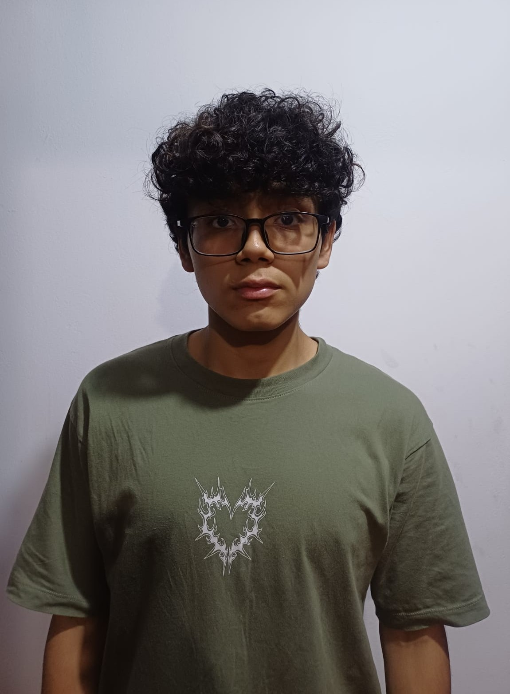

<table>
  <tr>
    <td></td>
    <td style="vertical-align: middle; padding-left: 15px;">
      <h1>UNIVERSIDAD PERUANA CAYETANO HEREDIA</h1>
    </td>
  </tr>
</table>

<h3 align="center">PROYECTOS PARA INGENIERIA – GRUPO 6</h3>

##  Sistema inteligente de detección de desperdicio energético en ambientes
---
## 🌍 Descripción del Equipo

Somos el **Equipo 06** del curso **Proyecto Integrador 2026-2**, conformado por estudiantes de **Ingeniería Ambiental e Ingeniería Informática**.

Nuestro proyecto busca desarrollar un **sistema inteligente de detección de desperdicio energético en ambientes**, integrando **IoT, sensores y Machine Learning** para monitorear el consumo eléctrico, detectar comportamientos anómalos y estimar su impacto energético, económico y ambiental.

---
---

### 🎯 Objetivos de Desarrollo Sostenible (ODS)

| ODS | Meta | Impacto esperado |
|---|---|---|
| ⚡ **ODS 7: Energía asequible y no contaminante** | **Meta 7.3:** Mejorar la eficiencia energética. | ⚡ **Contribuir a reducir el desperdicio energético**, mediante la detección de consumos anómalos y promoviendo un uso más eficiente de la electricidad. |
| 🏙️ **ODS 11: Ciudades y comunidades sostenibles** | **Meta 11.6:** Reducir el impacto ambiental negativo de las ciudades. | 🏢 **Promover ambientes y edificios más eficientes y sostenibles**, mediante una mejor gestión del consumo energético. |
| ♻️ **ODS 12: Producción y consumo responsables** | **Meta 12.2:** Lograr el uso eficiente y sostenible de los recursos naturales. | 📊 **Fomentar un consumo energético más responsable**, facilitando la identificación de posibles desperdicios y una mejor toma de decisiones. |
| 🌱 **ODS 13: Acción por el clima** | **Meta 13.3:** Mejorar la sensibilización y las capacidades frente al cambio climático. | 🌎 **Generar conciencia sobre el impacto ambiental del consumo energético**, mediante la estimación de emisiones de GEI asociadas en kg CO₂e. |

---
---

## 📸 Fotografía del Equipo  

  <em>Figura 1. Fotografía del equipo 06</em>

---
---
🎯 Misión

Desarrollar un sistema inteligente de monitoreo energético que, mediante IoT y Machine Learning, permita detectar posibles desperdicios de electricidad en tiempo real y brindar información útil sobre su impacto energético, económico y ambiental.

👁️ Visión

Contribuir al desarrollo de edificios y espacios más eficientes y sostenibles, promoviendo el uso responsable de la energía mediante tecnologías inteligentes que ayuden a reducir el desperdicio y las emisiones de gases de efecto invernadero.
---
---
## 👥 Integrantes del Equipo  

| Foto | Nombre | Rol | Intereses |
|------|--------|-----|-----------|
|  | **Belevan Amaro Bertha Dominik** | Líder del equipo | Innovación social, sostenibilidad |
|  | **Mónica Cristina Huaman Bernal** | Responsable de investigación | Gestión ambiental, desarrollo comunitario |
|  | **Piero Cemei Romero Meza** | Diseñador | Diseño de prototipos, creatividad aplicada |
|  | **Josue Enmanuel Sayago Morán** | Encargado/a de documentación | Comunicación científica, redacción técnica |
|  | **Diego Alessandre Murga Saavedra** | Programador/a - Modelador/a | Programación, análisis de datos, simulación |

---
---
##  📌 Resumen Final

  ⚡ ───────────── 🌱 🤖 🌍 ───────────── ⚡

Este README presenta quiénes somos como **Equipo 06**, la problemática que buscamos abordar y la propuesta que desarrollaremos durante el curso **Proyecto Integrador 2026-2**.

Nuestro proyecto propone un **Sistema Inteligente de Detección de Desperdicio Energético en Ambientes**, integrando tecnologías como **IoT, sensores y Machine Learning** para monitorear el consumo eléctrico, identificar comportamientos anómalos y generar alertas ante posibles situaciones de desperdicio energético.

Además, el sistema permitirá visualizar indicadores como:

El sistema permitirá visualizar información relevante como:

- ⚡ **Consumo energético:** kWh
- ⚠️ **Energía asociada al consumo anómalo:** kWh
- 💸 **Costo energético estimado:** S/
- 🌱 **Emisiones de GEI asociadas:** kg CO₂e
- 🚨 **Alertas de posibles situaciones de desperdicio energético**

De esta manera, buscamos transformar los datos recopilados en información útil para identificar consumos anómalos, evaluar su impacto y facilitar una gestión más eficiente y responsable de la energía.

> 🌱 **Nuestro propósito:** Convertir datos en decisiones que ayuden a reducir el desperdicio energético y su impacto ambiental.

### 🌍 ODS relacionados

  ⚡ <b>ODS 7</b> &nbsp; • &nbsp;
  🏙️ <b>ODS 11</b> &nbsp; • &nbsp;
  ♻️ <b>ODS 12</b> &nbsp; • &nbsp;
  🌎 <b>ODS 13</b>

---

  💡 <b>Tecnología + Eficiencia Energética + Sostenibilidad</b> 🌱

  <i>Equipo 06 | Proyecto Integrador 2026-2</i>

